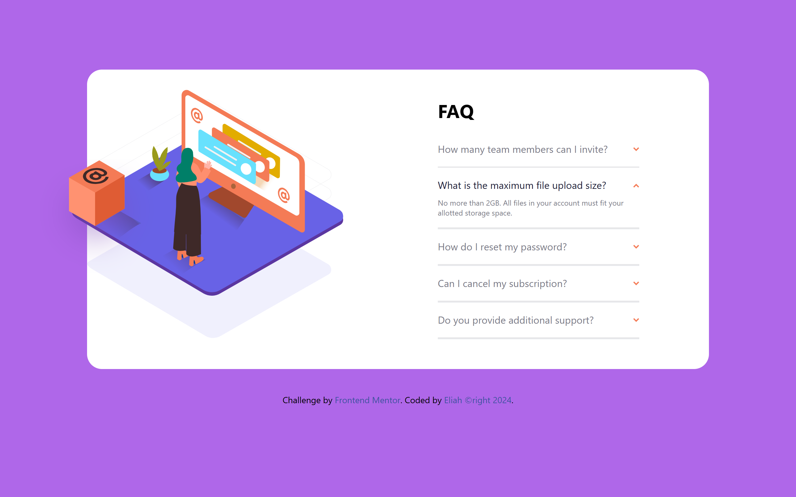
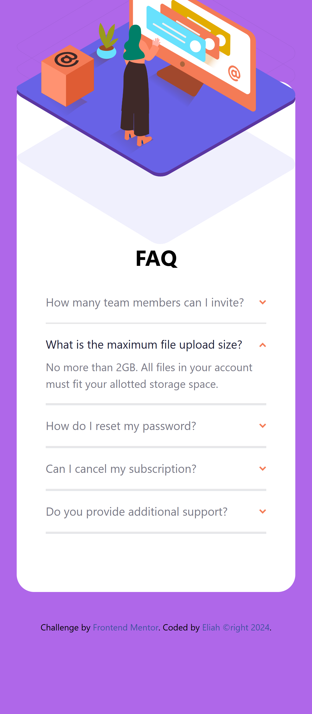
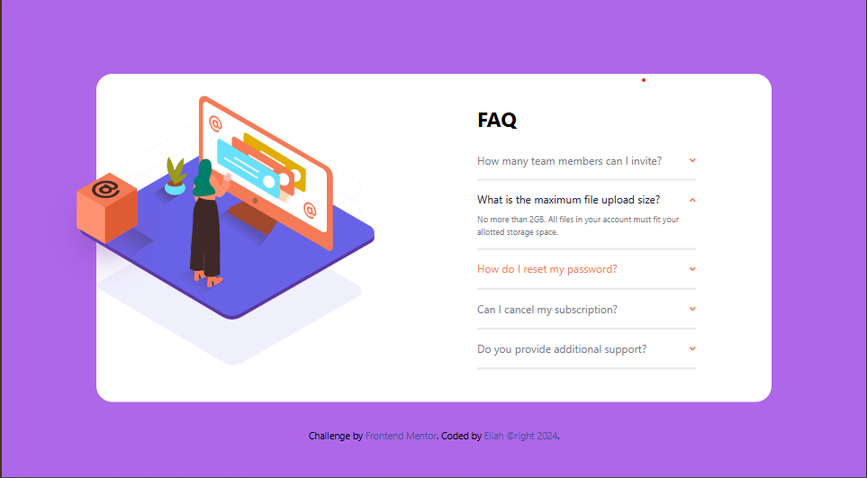

# Frontend Mentor - FAQ accordion card solution

This is a solution to the [FAQ accordion card challenge on Frontend Mentor](https://www.frontendmentor.io/challenges/faq-accordion-card-XlyjD0Oam). Frontend Mentor challenges help you improve your coding skills by building realistic projects. 

### Screenshot

  

### Links

- Solution URL: [Solution URL](http://127.0.0.1:5500/public/index.html)
- Live Site URL: [Add live site URL here](https://your-live-site-url.com)

## My process

### Built with

- Semantic HTML5 markup
- Flexbox
- CSS Grid
- Mobile-first workflow
- [Tailwindcss](https://reactjs.org/) - CSS Framework

## Author

- Website - [My github site](https://github.com/okedo01)
- Frontend Mentor - [@yourusername](https://www.frontendmentor.io/profile/yourusername)
